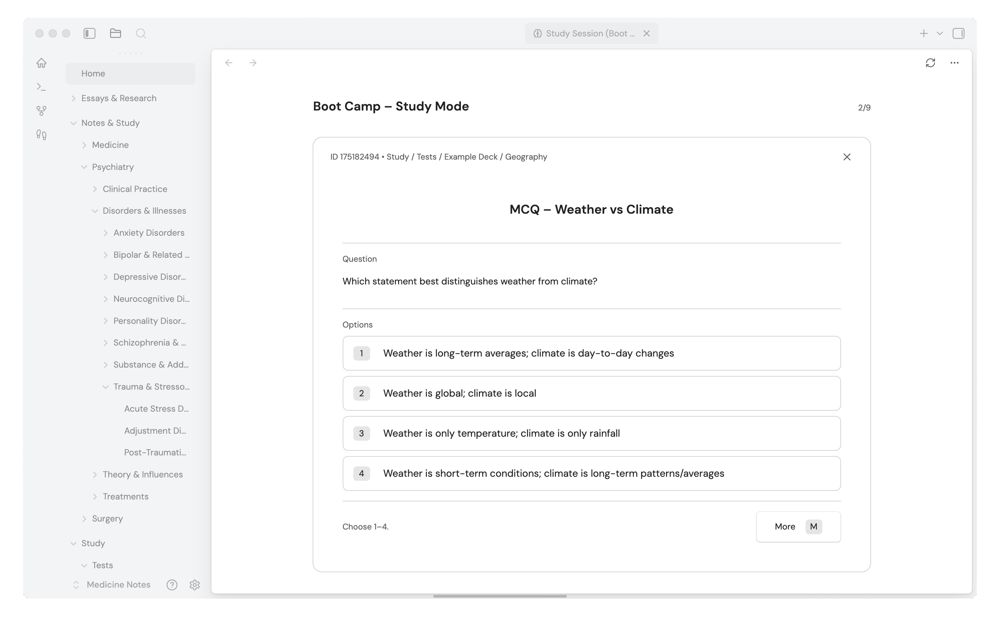
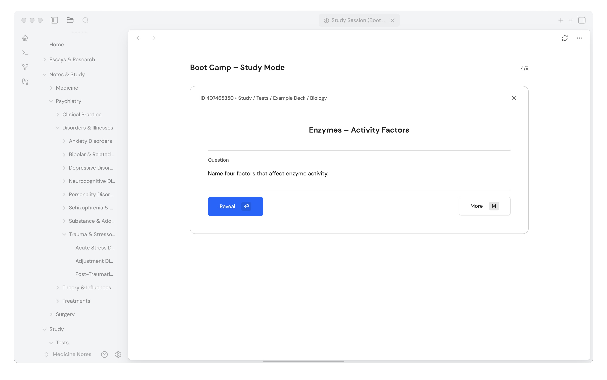
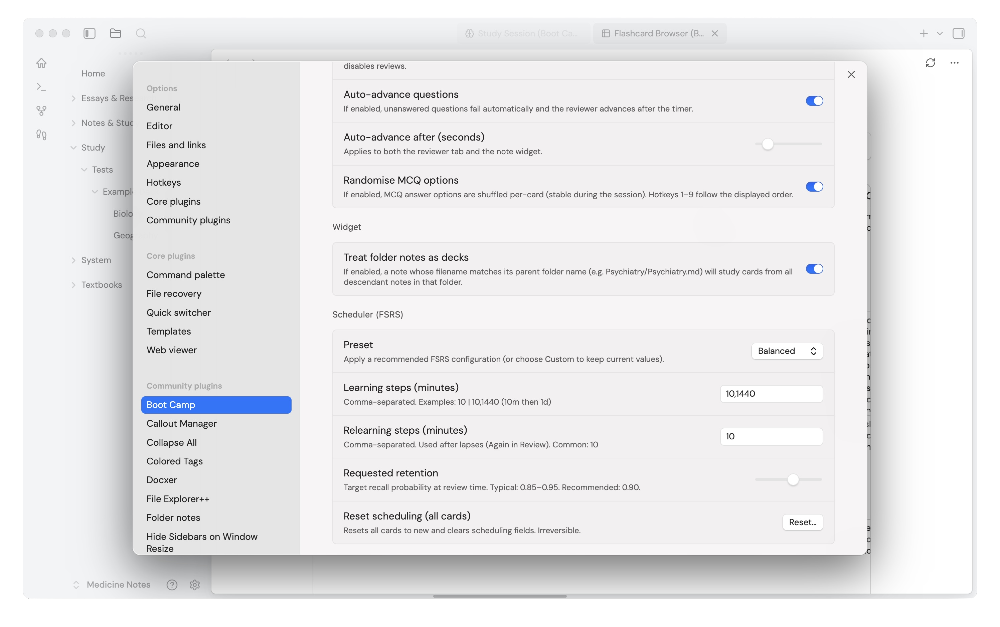

# Sprout

> [!NOTE]
> Alpha 0.0.3 has just been released – this is a massive update to the alpha and some parsing errors may require you to update your flashcards. A tutorial, better description and screenshots of the ne user interface will be released in the coming weeks.
 
Sprout (Formerly, Boot Camp for Obsidian) is a plugin for writing flashcards directly inside Markdown notes and reviewing them within Obsidian with an FSRS-based scheduler. It is currently in open Alpha testing.

## Quick start

1. Write cards in any note using the formats below.
2. Sync to create/update cards (anchors will be added if missing).
3. Start study session, choose a deck/scope, and review.

## Card identity

After syncing, each card block has an anchor line:

^bc-#########

This anchor is the only stable identifier for that card. Do not edit or delete it. 

If you delete it you can copy the ID number from the card browser (View All Flashcards), otherwise when you next sync it will be assigned a new anchor and all learning steps will be lost.

## Writing cards in notes

Cards are pipe-delimited lines. Each line starts and ends with a pipe character.

T (title) is optional
I (info) is optional

Requirements by type:
- Basic: Q and A required
- Cloze: CQ required
- MCQ: MCQ and O: required

## Basic card

T | Title (Optional) |

Q | Question (required) |

A | Answer (required) |

I  | Extra Information (Optional) |

## Cloze card

Use cloze markers like {{c1::...}}.

T | Title (Optional) |

CQ | Cloze text with {{c1::deletions}} (required) |

I  | Extra Information (Optional) |

## MCQ card

Put the options on the O: line, separated by pipes. Mark the correct option by wrapping it in asterisks.

T | Title (Optional) |

MCQ | Question stem (required) |

O:  | Option 1 | *Option 2 (correct)* | Option 3 | Option 4 |

I  | Extra Information (Mandatory for MCQs) |

## Multi-line cards or cards with images

Fields can have multiple lines or images (the only exception is the options line for MCQs). For multiple lines the pipe acts as the end of the field. Images can be introduced as Obsidian attachments e.g ![Image One.png] in your note, and they will appear when studying.

T | Example – Multi-line Answer with Image |

Q | List three key features of Example Condition X and include a diagram. |

A | Line One

Line Two

![Image.png] |

I | Keep answers short and structured. |

## Alternative: Add Flashcard button

You can create cards using the Add Flashcard button instead of writing the block manually. This inserts a correctly formatted card block into the current note and syncs it into the database.

## Start study session

Use Start study session to choose a deck/scope and revise due cards.

During review you can:
- edit the card
- open the parent note
- bury the card (hide until tomorrow)
- suspend the card (remove from scheduling until unsuspended in card browser)

## Card Browser

Use the Card Browser to manage cards across your vault:
- search and filter cards
- edit card content (writes back to the source note)
- suspend and unsuspend cards
- inspect due dates and scheduling state

## Scheduling

Scheduling is FSRS-based. Reviews use a two-option grading flow that updates the FSRS state and the next due date.

## Settings

Common settings include:
- randomise MCQ option order during review
- FSRS scheduler configuration (learning steps and FSRS parameters)
- notes folders and deck/scope configuration (where cards are discovered and how decks are defined)

## Alpha Release

This is an alpha release. All feedback and feature requests are greatly appreciated! 

## Screenshots

